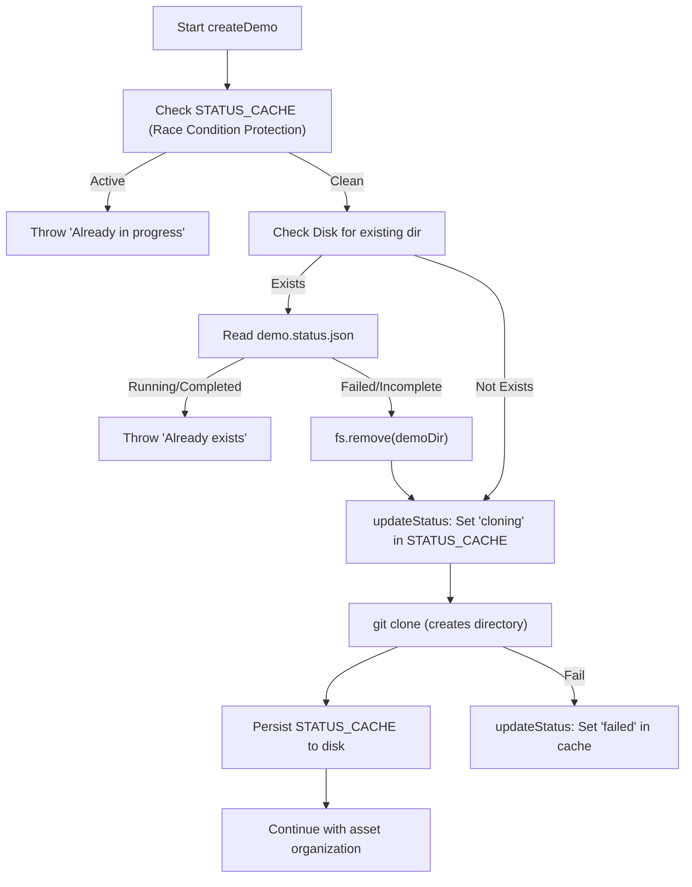

# Plan: Fix Demo Cloning Collision (v2)

The `git clone` command fails because `src/handlers/demoHandler.ts` creates the target directory and a `demo.status.json` file inside it **before** cloning. Git requires the destination directory to be empty or non-existent.

We will introduce an in-memory status cache to track the "cloning" state without creating the directory prematurely, while also addressing several edge cases.

## Proposed Changes

### 1. Refactor Status Management in [`src/handlers/demoHandler.ts`](src/handlers/demoHandler.ts)

- **Introduce `STATUS_CACHE`**: A module-level object to store demo statuses in memory.
- **Update `updateStatus`**:
    - Always update `STATUS_CACHE`.
    - Only write `demo.status.json` to disk if the directory already exists.
    - Remove the `fs.ensureDir(demoDir)` call.
- **Update `getDemoStatus`**:
    - Check `STATUS_CACHE` first, then the filesystem.

### 2. Robust `createDemo` Logic in [`src/handlers/demoHandler.ts`](src/handlers/demoHandler.ts)

- **Collision Detection & Race Conditions**:
    - Check `STATUS_CACHE` and filesystem immediately.
    - Set the status to `cloning` in the cache *before* any async operations to prevent multiple simultaneous requests for the same slug from proceeding.
- **Cleanup**:
    - If a directory exists but is not in a `completed` or `running` state, remove it entirely before starting. This handles **partial clones** from previous failed attempts.
- **Delayed Directory Creation**:
    - Remove the premature `fs.ensureDir(demoDir)` call on line 74.
    - Let `simpleGit().clone()` handle the creation of the target directory.

### 3. Edge Case Considerations

| Edge Case | Handling Strategy |

| :--- | :--- |

| **Concurrent Requests** | Handled by checking/setting `STATUS_CACHE` synchronously at the start of `createDemo`. |

| **Server Restart** | In-memory cache is lost. If the directory exists but has no cache entry, `getDemoStatus` will read from disk. If the clone was in progress, the directory will be cleaned up on the next `createDemo` attempt. |

| **Partial Clone** | `fs.remove(demoDir)` is called if the status is not `completed` or `running`. |

| **Network Failure** | `try-catch` block will catch the error, update status to `failed`, and leave the directory for potential cleanup on retry. |

## Verification Plan

- **Happy Path**: Create a demo with a new slug. Verify UI shows "cloning", then finishes.
- **Collision Path**: Try to create two demos with the same slug simultaneously. The second should fail immediately.
- **Cleanup Path**: Intentionally break a clone (e.g., use an invalid repo), then try again with the same slug. It should clean up the old folder and start fresh.
