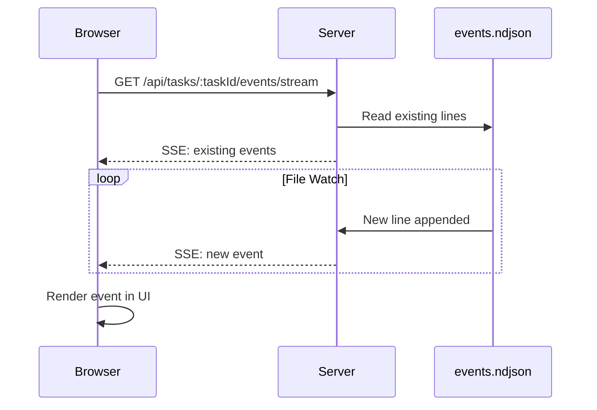

# Live Events Viewer for Agent Activity

## Overview

Enhance the Agent Activity section in [public/demo.html](public/demo.html) to display the full `events.ndjson` file with live updates. Users can toggle between a formatted view (collapsible thinking blocks, tool calls) and raw JSON with syntax highlighting.

## Architecture



## Backend Changes

### 1. New SSE Streaming Endpoint

Add to [src/server.ts](src/server.ts):

```typescript
// Stream events.ndjson with live updates
app.get('/api/tasks/:taskId/events/stream', async (req, res) => {
  // SSE headers
  // Find events.ndjson path using findTaskById
  // Send existing events, then watch file for changes
  // Use fs.watch() or chokidar for file watching
});
```

Key behaviors:

- Returns all existing events on connect
- Watches the file for new lines and streams them
- Handles client disconnect cleanup
- Supports `?from=lineNumber` query param to resume from a position

### 2. Enhanced getLogs in TaskStatusManager

Modify [src/cursor/taskStatusManager.ts](src/cursor/taskStatusManager.ts) to support:

- Getting total line count
- Reading from a specific line offset
- Return line numbers with events for resume capability

## Frontend Changes

### 3. Expand Agent Activity Section

Update [public/demo.html](public/demo.html) to add:

- View mode toggle (Formatted / Raw)
- Filter controls (by event type)
- Event count and connection status indicator
- Expanded container for event display
```html
<div class="events-viewer-controls">
    <div class="view-toggle">
        <button id="formattedViewBtn" class="active">Formatted</button>
        <button id="rawViewBtn">Raw JSON</button>
    </div>
    <select id="eventTypeFilter">
        <option value="all">All Events</option>
        <option value="thinking">Thinking</option>
        <option value="tool_call">Tool Calls</option>
        <option value="system">System</option>
    </select>
</div>
<div id="eventsContainer" class="events-container"></div>
```


### 4. New Events Viewer JavaScript Module

Create [public/utils/events-viewer.js](public/utils/events-viewer.js):

```javascript
class EventsViewer {
    constructor(containerId, options) { }
    connect(taskId) { }      // Start SSE connection
    disconnect() { }          // Clean up
    setViewMode(mode) { }    // 'formatted' | 'raw'
    setFilter(type) { }      // Filter by event type
    renderEvent(event) { }   // Render single event
}
```

Features:

- **Formatted View**: Collapsible sections for thinking blocks, tool calls with args/results, syntax-highlighted code
- **Raw View**: JSON with syntax highlighting (using simple CSS-based highlighter)
- **Auto-scroll**: Auto-scroll to bottom when new events arrive (with toggle)
- **Performance**: Virtual scrolling or windowing for large event files (>1000 events)

### 5. CSS Styling

Add to [public/styles.css](public/styles.css):

- Event type badges (thinking, tool_call, system, user)
- Collapsible section animations
- JSON syntax highlighting
- Connection status indicator styles
- Dark/light theme support

## Event Rendering Examples

**Thinking Event (Formatted)**:

```
[Thinking] 08:12:08
  ▼ Opening and Reading Files
  I've got the initial step down: confirming the existence...
```

**Tool Call Event (Formatted)**:

```
[Tool Call] 08:12:08 - 08:12:13 (5s)
  ▼ readToolCall
  Path: /mnt/d/.../CURSOR_TASK.md
  ✓ Success (38 lines read)
```

## File Changes Summary

| File | Change |

|------|--------|

| [src/server.ts](src/server.ts) | Add `/api/tasks/:taskId/events/stream` SSE endpoint |

| [src/cursor/taskStatusManager.ts](src/cursor/taskStatusManager.ts) | Add `getEventCount()`, `streamEvents()` methods |

| [public/demo.html](public/demo.html) | Expand Agent Activity section with controls |

| [public/demo.js](public/demo.js) | Integrate EventsViewer, handle toggle/filter |

| [public/utils/events-viewer.js](public/utils/events-viewer.js) | New file - EventsViewer class |

| [public/styles.css](public/styles.css) | Add events viewer styles |