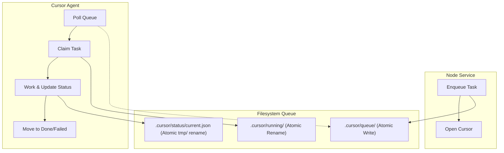

# Production-Grade File-Based Agent Queue Migration

This plan replaces brittle UI automation with a high-integrity filesystem queue.

## 1. Global Invariants & Safety

- **Atomic Renames**: Claiming a task MUST be an atomic `fs.rename`.
- **Same-Filesystem Check**: Validate that `queue/` and `running/` are on the same device/drive to ensure `rename` is atomic and not a slow copy-then-delete.
- **Atomic Status Writes**: Status JSON is written to `status/tmp/` and then renamed to `current.json`.
- **Secret Hygiene**: Task files and status JSON MUST NOT contain API keys, tokens, or sensitive credentials.
- **Git Hygiene**: 
    - `.cursor/queue/`, `.cursor/running/`, `.cursor/done/`, `.cursor/failed/`, and `.cursor/status/` MUST be added to `.gitignore`.
    - `.cursorrules` MUST be committed to the repo.

## 2. Queue Specification

### Directory Tree

```text
.cursor/
  queue/          # Pending tasks (0001_taskId.md)
  running/        # Active task lock
  done/           # Successful tasks
  failed/         # Failed tasks + error context
  status/         
    current.json  # Live dashboard data
    tmp/          # Staging for atomic writes
    tasks/        # (Optional) historical status per task
```


### Task File Standard

**Filename**: `NNNN_taskId.md` (e.g., `0001_86b7yt9z5.md`)**Content**:

```markdown
---
id: 0001
taskId: 86b7yt9z5
client: "Client Name"
createdAt: "2026-01-04T17:00:00Z"
priority: "high"
branch: "kwd-86b7yt9z5"
---
# Instructions
Implement the new header component...
```


### Status Schema (`current.json`)

```json
{
  "task": { "file": "0001_abc.md", "id": 1, "taskId": "abc" },
  "state": "running", // queued | running | done | failed | stale
  "percent": 45,
  "step": "Updating CSS variables",
  "lastUpdate": "2026-01-04T17:05:00Z",
  "notes": ["Colors updated", "Testing responsiveness"],
  "errors": []
}
```

---

## Workstream 1: Core Queue Logic (Agent A)

**Goal**: Primitives, atomic operations, and state management.

- [ ] **A1: Primitives**: Implement `src/cursor/agentQueue.ts` with the directory tree and same-filesystem validation.
- [ ] **A2: Atomic Enqueue**: `enqueueTask()` with collision-safe `0001` prefix and YAML frontmatter. Max task size cap: 1MB.
- [ ] **A3: Atomic Claim**: `claimNextTask()` with atomic rename and same-drive validation.
- [ ] **A4: Atomic Status**: `updateStatus()` via `status/tmp/` staging.
- [ ] **A5: Recovery**: `detectStaleTasks(ttlMinutes)` to move abandoned `running/` tasks to `failed/` or back to `queue/`.
- [ ] **A6: Helpers**: Manual `requeueTask(taskId)` utility to reset a failed task.

**Prompt for Agent A**:> "Implement Workstream A in `src/cursor/agentQueue.ts`. Focus on atomicity: use `fs.rename` for claiming tasks and staging in `status/tmp/` for JSON writes. Implement same-filesystem checks. Deliver `enqueueTask` (with YAML frontmatter), `claimNextTask`, `updateStatus`, and `detectStaleTasks`. Ensure max task size is capped at 1MB."---

## Workstream 2: Service Integration (Agent B)

**Goal**: Connect the workflow and remove UI automation.

- [ ] **B1: Orchestration**: Refactor `src/cursor/workspaceManager.ts` to call `agentQueue.enqueueTask()`.
- [ ] **B2: Cleanup**: Remove SendKeys/PowerShell from `src/cursor/agentTrigger.ts`. Trigger now only verifies Cursor state.
- [ ] **B3: Config**: Update `config.json` with `triggerMode: "queue"`, `queue.ttlMinutes: 120`, and `maxTasksPerWorkspace: 10`.
- [ ] **B4: Git Auto-Config**: Automatically append queue folders to `.gitignore` if not present.
- [ ] **B5: Rollback**: Support `triggerMode: "ui"` for emergency fallback.

**Prompt for Agent B**:> "Refactor the service for Workstream B. Update `workspaceManager.ts` to use the new `agentQueue` system. Remove all UI automation (SendKeys/PS) from `agentTrigger.ts`. Update `config.json` with new queue settings (`triggerMode`, `ttl`, `maxTasks`). Add logic to ensure `.cursor/` subfolders (except `.cursorrules`) are in `.gitignore`."---

## Workstream 3: Agent Protocol (Agent C)

**Goal**: The Cursor-side worker logic.

- [ ] **C1: .cursorrules**: Template that makes Cursor poll `queue/`, claim via `rename`, and update `current.json`.
- [ ] **C2: Completion**: Rules for moving to `done/` (success + test pass + commit) or `failed/`.
- [ ] **C3: Safety Rules**: Explicit instructions to NEVER commit `.cursor/queue` and NEVER log secrets.
- [ ] **C4: Idempotency**: Instructions for the agent to check if a task's changes are already present before starting.

**Prompt for Agent C**:> "Design the `.cursorrules` template for Workstream C. It must instruct Cursor to: 1. Pick lowest ID from `queue/`, 2. Atomically move to `running/`, 3. Frequently update `status/current.json` with the specified schema, 4. On success, move to `done/` and commit locally. Include safeguards against secret leakage and instructions for idempotency checks."---

## Architecture Diagram

