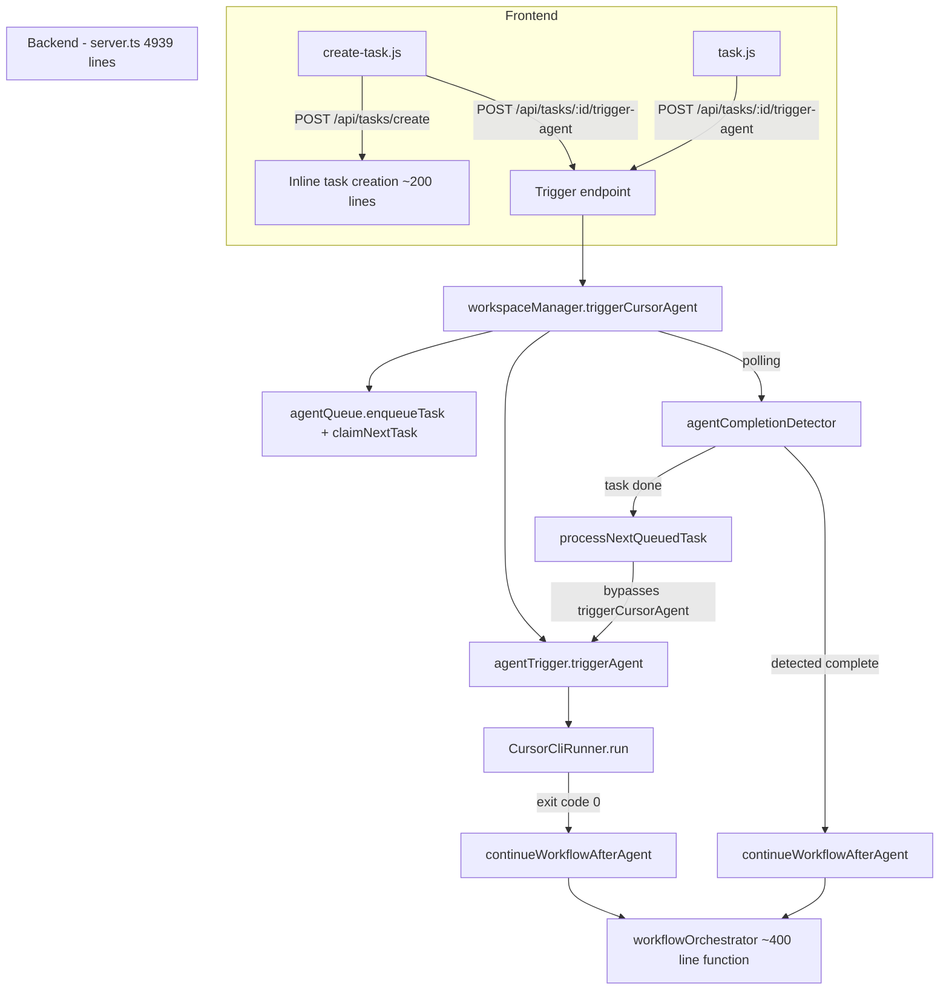

# Task & Agent Flow: 4-Phase Consistency and Refactor Plan

## Current Architecture

Key files involved:

- [`public/create-task.js`](public/create-task.js) + [`public/create-task.html`](public/create-task.html) -- task creation UI
- [`public/task.js`](public/task.js) + [`public/task.html`](public/task.html) -- task detail / run agent UI
- [`src/server.ts`](src/server.ts) -- monolith with inline endpoints (4939 lines, 4x model validation)
- [`src/cursor/workspaceManager.ts`](src/cursor/workspaceManager.ts) -- `triggerCursorAgent` orchestration
- [`src/cursor/agentTrigger.ts`](src/cursor/agentTrigger.ts) -- `triggerAgent` (non-blocking runner launch)
- [`src/cursor/agentCompletionDetector.ts`](src/cursor/agentCompletionDetector.ts) -- polling + `processNextQueuedTask`
- [`src/cursor/runner.ts`](src/cursor/runner.ts) -- `CursorCliRunner`
- [`src/workflow/workflowOrchestrator.ts`](src/workflow/workflowOrchestrator.ts) -- `continueWorkflowAfterAgent`
- [`src/state/stateManager.ts`](src/state/stateManager.ts) -- `WorkflowState`, task state CRUD
- [`src/cursor/agentQueue.ts`](src/cursor/agentQueue.ts) -- file-based queue system

---

## Phase 1: Frontend Consistency and UX Hardening

Fixes inconsistencies between `create-task.js` and `task.js`, and tightens the UI against edge cases.

### 1.1 Standardize API usage in `create-task.js`

**Problem**: `create-task.js` uses raw `fetch()` calls while `task.js` uses the centralized `api.post()` / `api.get()` helper from [`public/utils/api.js`](public/utils/api.js). This means `create-task.js` misses automatic retry, 4xx handling, and base URL resolution.**Fix**: Refactor `create-task.js` to use `api.post()` and `api.get()` from the shared utility.

### 1.2 Pass model when triggering agent from create-task

**Problem**: `create-task.js` `handleTriggerAgent()` does not send `{ model }` in the POST body. The user selected a model during creation but it is not forwarded to the trigger-agent call. `task.js` correctly reads `agentModelSelect` and sends it.**Fix**: Forward the model used during creation (from `createdTaskId` context) in the trigger-agent call.

### 1.3 Handle structured error responses (402 credit, 422 model)

**Problem**: The trigger-agent endpoint returns structured JSON with `creditError`, `modelError`, `errorCategory` etc. `task.js` has dedicated modal handling for these (`modelErrorModal`). `create-task.js` blindly throws on non-OK, losing this context.**Fix**: Add error response parsing in `create-task.js` to show appropriate messages for credit and model errors.

### 1.4 Prevent double-click on trigger button

**Problem**: No debounce or immediate disable on the "Run Agent Now" button in the success panel. Rapid clicks could fire multiple trigger-agent requests.**Fix**: Disable button immediately on click (already done for submit, just verify for trigger).

### 1.5 Unused `updateStatus` promise in `task.js`

**Problem**: In `task.js` `handleTriggerAgent()`, there is a `const updateStatus = (text, delay) => new Promise(...)` that resolves after a delay but the resolved value is never used meaningfully. It appears to be leftover from a staged-UX approach.**Fix**: Remove or simplify this dead code path.---

## Phase 2: Backend Task Creation -- Extract Handler and Fix Edge Cases

The `/api/tasks/create` endpoint is ~200 lines inline in a 4939-line `server.ts`. This phase extracts it and fixes edge cases.

### 2.1 Extract task creation into a handler module

**Problem**: `server.ts` is a 4939-line monolith. The `/api/tasks/create` endpoint (lines 2012-2215) has complex logic (validation, ID generation, state initialization, branch creation, prompt generation) all inline.**Fix**: Create [`src/handlers/taskCreateHandler.ts`](src/handlers/taskCreateHandler.ts) (mirroring the existing [`src/handlers/taskImportHandler.ts`](src/handlers/taskImportHandler.ts) pattern). Move all business logic there, leaving a thin route definition in `server.ts`.

### 2.2 Extract shared model validation middleware

**Problem**: Model validation (`availableModels.includes(model)`) is copy-pasted 4 times in `server.ts` (task create, task import, trigger-agent, demo create).**Fix**: Create a shared `validateModel(model: string)` utility or Express middleware that all endpoints reuse.

### 2.3 Add rollback on partial task creation failure

**Problem**: If `saveTaskInfo` succeeds but `ensureDevBranch()` or `generatePromptFile()` throws, the task exists in a half-initialized state (state.json present, but no branch or prompt file). The user sees the task on the dashboard but it may fail when the agent is triggered.**Fix**: Wrap the multi-step initialization in a try-catch that cleans up the task directory on failure, or at minimum mark the task state as `ERROR` with a descriptive message so the user knows what happened.

### 2.4 Fix custom systemPrompt overwriting prompt metadata

**Problem**: When `systemPrompt` is provided, the code does a raw `fs.writeFile(promptPath, trimmedSystemPrompt)` which replaces the entire generated CURSOR_TASK.md. This strips the Task ID, branch name, and standard structure. Later, `shouldGeneratePrompt()` checks for `**Task ID**:` in the file. If a user provides a custom prompt without that marker, subsequent re-triggers will regenerate the prompt and lose the custom content.**Fix**: Either inject the system prompt into the standard template (e.g., as a "Custom Instructions" section), or add a separate flag/file to track that this task uses a custom prompt.

### 2.5 Frontend: expose notificationEmail field (or remove backend dead code)

**Problem**: The backend `/api/tasks/create` accepts `notificationEmail` and validates it, but the [`create-task.html`](public/create-task.html) form has no such field. The feature is unreachable from the UI.**Fix**: Either add a notification email field to the create-task form, or remove the dead parameter from the endpoint to reduce confusion.---

## Phase 3: Agent Trigger Flow -- Race Conditions, Deduplication, Dead Code

This phase addresses the most dangerous bugs: double-triggers, inconsistent queue processing paths, and dead code.

### 3.1 Prevent duplicate task enqueue on re-trigger

**Problem**: `triggerCursorAgent()` in [`workspaceManager.ts`](src/cursor/workspaceManager.ts) calls `agentQueue.enqueueTask()` without first checking if the task is already queued or running. Clicking "Run Agent" twice (or quickly on create-task then task page) can enqueue the same task twice, leading to it running twice sequentially.**Fix**: Before `enqueueTask()`, check `agentQueue.isTaskQueued(taskId)` and `agentQueue.isTaskRunning(taskId)`. If already queued/running, return early with an informational message instead of silently enqueuing a duplicate.

### 3.2 Unify the queue-processing path through `triggerCursorAgent`

**Problem**: `processNextQueuedTask()` in [`agentCompletionDetector.ts`](src/cursor/agentCompletionDetector.ts) calls `triggerAgent()` directly, bypassing `triggerCursorAgent()`. This skips: status resets, demo guard checks, workflow state update to `IN_PROGRESS`, and completion detection setup.**Fix**: Refactor `processNextQueuedTask()` to call `triggerCursorAgent()` instead, or extract the shared pre-trigger logic (status reset, state update, demo guard) into a common function that both paths call.

### 3.3 Fix silent queue failure returning HTTP 200

**Problem**: In `triggerCursorAgent()`, when the queue `catch` block fires (e.g., max tasks reached), it updates the status to FAILED and returns without throwing. The API endpoint in `server.ts` then responds with `{ success: true }`. The frontend shows "Agent started successfully!" for a task that actually failed.**Fix**: Either re-throw the error so the endpoint returns 500, or return a status indicator that the endpoint can check before responding with success.

### 3.4 Remove dead code: `triggerViaFile`, `cliWrapper.runCursorAgent`, unused config reads

**Problem**:

- `triggerViaFile()` in [`agentTrigger.ts`](src/cursor/agentTrigger.ts) (lines 288-333) is never called - the system always uses `CursorCliRunner`.
- `runCursorAgent()` in [`src/cursor/cliWrapper.ts`](src/cursor/cliWrapper.ts) is legacy dead code, also never called.
- `triggerAgent()` reads `triggerMode` and `method` from config but ignores them, always using CLI runner.

**Fix**: Remove `triggerViaFile`, remove or deprecate `cliWrapper.ts`, and remove the unused config reads to reduce confusion.

### 3.5 Clarify the dual completion detection paths

**Problem**: Both the runner exit handler (`agentTrigger.ts` line 178) and the polling-based `agentCompletionDetector.ts` can call `continueWorkflowAfterAgent()`. The lock mechanism in the orchestrator prevents duplicate execution, but having two independent paths is fragile and confusing.**Fix**: Document the intended precedence clearly with inline comments. The runner exit handler is the primary path; the completion detector is a safety net. Add a log message when the detector's call is deduplicated by the lock so operators can see it is working as intended. Consider whether the completion detector is still needed now that the CLI runner reliably reports exit codes.---

## Phase 4: Workflow Orchestrator Simplification and State Consistency

### 4.1 Break up `_continueWorkflowAfterAgentInternal` (400 lines)

**Problem**: This single function handles screenshot capture, demo step transitions, test execution, change summary generation, approval creation, and notification sending. At 400 lines it is difficult to test, debug, or modify safely.**Fix**: Extract into focused sub-functions: `capturePostAgentArtifacts()`, `runPostAgentTests()`, `createApprovalAndNotify()`. Each handles its own error flow and state updates. The orchestrator function becomes a pipeline of calls.

### 4.2 Centralize error categorization

**Problem**: Error categorization logic (credit, model, auth, network detection via regex) is duplicated in:

- `agentTrigger.ts` (lines 196-223)
- `workflowOrchestrator.ts` `processTask` catch block (lines 199-210)
- `server.ts` trigger-agent endpoint (lines 3196-3229)

**Fix**: Create a shared `categorizeError(error: Error): ErrorInfo` utility that all three locations call.

### 4.3 Ensure local tasks get the same pre-flight as ClickUp tasks

**Problem**: ClickUp tasks go through `processTask()` which runs git validation, initial screenshots, test detection, and workspace preparation. Local tasks (from `/api/tasks/create`) skip all of this -- they only get branch creation and prompt generation. When the agent is triggered, `triggerCursorAgent` goes straight to enqueue/trigger without git validation or workspace prep.**Fix**: When the agent is triggered for a local task (via the trigger-agent endpoint), call `prepareWorkspace()` from `workspaceManager` if it has not been called yet (check for a flag in task state). This ensures clean working directory, base commit tracking, and run metadata initialization.

### 4.4 Ensure workflow state is always set to IN_PROGRESS before agent starts