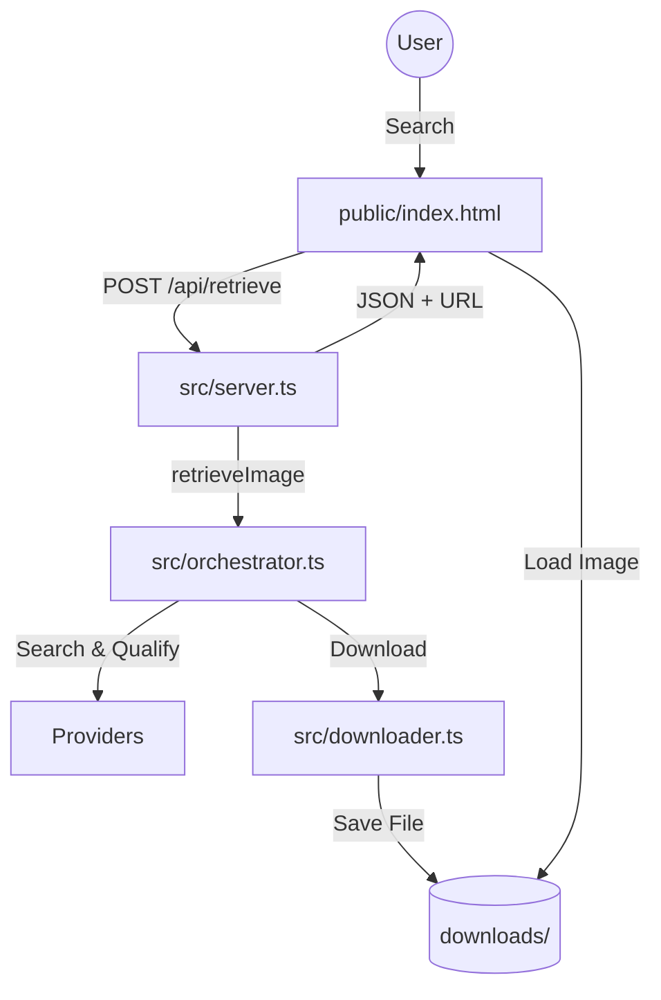

# Plan: Verify App and Enhance Image Display

This plan outlines the steps for another agent to verify the `ImageRetriever` application, from backend processing to frontend display.

## 1. Environment and Dependencies

-   **Verify API Keys**: Ensure that `.env` contains valid keys for `PEXELS_API_KEY`, `UNSPLASH_ACCESS_KEY`, etc.
-   **Install Dependencies**: Run `npm install` to ensure all packages are present.
-   **Build Project**: Run `npm run build` to compile TypeScript to JavaScript in the `dist/` directory.

## 2. Server Execution

-   **Start Server**: Run `npm run serve`.
-   **Confirm Running**: Verify the terminal shows `Server running at http://localhost:3000`.

## 3. Frontend Integration Testing

-   **Access UI**: Open `http://localhost:3000` in a local browser tab.
-   **Execute Search**: 

    1. Enter a query (e.g., "mountain sunset").
    2. Select a shape (e.g., "landscape").
    3. Provide context (e.g., "A travel blog post about hiking in the Alps").
    4. Click **Retrieve Image**.

-   **Verify Backend Response**: Check the browser console and network tab to ensure the POST request to `/api/retrieve` returns a `200 OK` with a valid JSON payload including `imageUrl`.

## 4. Image Display Verification

-   **Check Display**: Ensure the image appears in the result section.
-   **Verify Pathing**: The `src` of the `` tag should be something like `/downloads/pexels-12345.jpg`.
-   **Static Serving**: Confirm that [src/server.ts](src/server.ts) correctly serves the `downloads` directory via `app.use('/downloads', express.static(downloadsDir))`.

## 5. Potential Improvements (If Display Fails)

-   **CORS/Path Issues**: If the image doesn't load, verify that the `downloads` folder path is correctly resolved relative to the `dist/server.js` file.
-   **UI Feedback**: Update [public/index.html](public/index.html) to show a "no image found" message if the backend returns a 404 or an empty result.
-   **Loading State**: Ensure the loading spinner is active until the backend returns, and optionally add a skeleton loader for the image itself.
